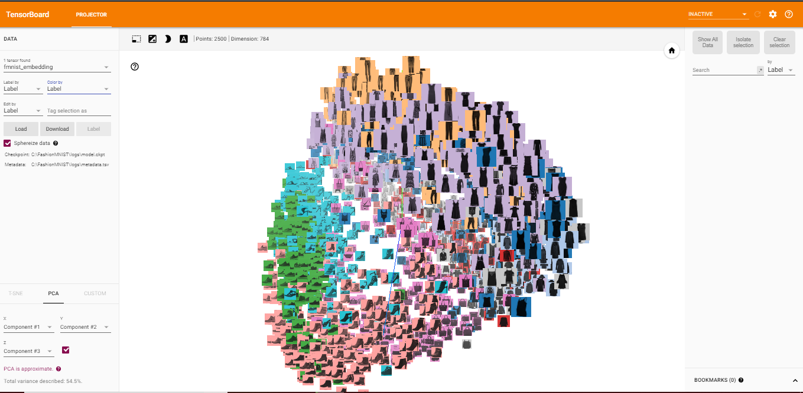

# Fashion MNIST Image Classification
This repo shows a set of Jupyter Notebooks demonstrating a variety of Convolutional Neural Networks models I built to classify images for the [Fashion MNIST](https://github.com/zalandoresearch/fashion-mnist) dataset. It is a dataset of Zalando's article images — consisting of a training set of 60,000 examples and a test set of 10,000 examples. Each example is a 28x28 grayscale image, associated with a label from 10 classes. The dataset serves as a direct drop-in replacement for the original [MNIST](http://yann.lecun.com/exdb/mnist/) dataset for benchmarking machine learning algorithms. It shares the same image size and structure of training and testing splits.

Here are the different notebooks:
* [1-Convolution Layer CNN](http://nbviewer.jupyter.org/github/khanhnamle1994/fashion-mnist/blob/master/CNN-1Conv.ipynb): Trained a simple CNN classifier with 1 convolution layer, 1 max-pooling layer, 2 dense layers, and 1 dropout layer. Achieved 92.29% accuracy.
* [3-Convolution Layer CNN](http://nbviewer.jupyter.org/github/khanhnamle1994/fashion-mnist/blob/master/CNN-3Conv.ipynb): Trained a deeper CNN classifier with 3 convolution layers, 2 max-pooling layers, 2 dense layers, and 4 dropout layers. Achieved 91.17% accuracy.
* [4-Convolution Layer CNN](http://nbviewer.jupyter.org/github/khanhnamle1994/fashion-mnist/blob/master/CNN-4Conv.ipynb): Trained an even deeper CNN classifier with 4 convolution layers, 2 max-pooling layers, 3 dense layers, 5 dropout layers, and 6 batch normalization layers. Achieved 93.52% accuracy.
* [VGG19](http://nbviewer.jupyter.org/github/khanhnamle1994/fashion-mnist/blob/master/VGG19-GPU.ipynb): Used transfer learning with the VGG19 pre-trained model. Achieved 76.64% accuracy.
* [TensorBoard Visualization](http://nbviewer.jupyter.org/github/khanhnamle1994/fashion-mnist/blob/master/TensorBoard-Visualization.ipynb): Visualized Fashion MNIST data using Tensorboard with t-SNE and PCA dimensionality reduction techniques.

Here's a visualization of Fashion MNIST data on TensorBoard:

## Requirements

* [Python 2.7](https://www.python.org/download/releases/2.7/) or [Python 3.6](https://www.python.org/downloads/release/python-360/)
* [Jupyter Notebook](http://jupyter.org/)

## Dependencies

Choose the latest versions of any of the dependencies below:

* [pandas](https://pandas.pydata.org/)
* [numpy](http://www.numpy.org/)
* [matplotlib](https://matplotlib.org/)
* [sklearn](http://scikit-learn.org/stable/)
* [keras](https://keras.io/)
* [tensorflor](https://www.tensorflow.org/)

## License

MIT. See the LICENSE file for the copyright notice.
